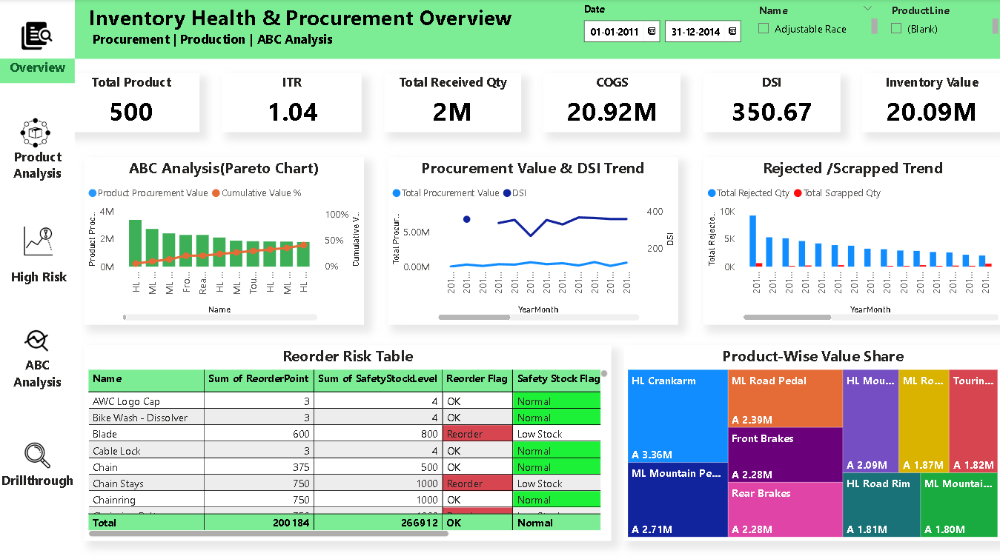
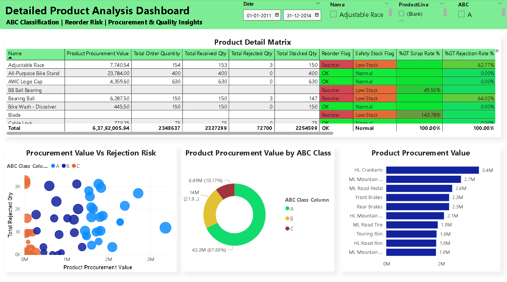

# 📊 Supply Chain Management Dashboard (Power BI)

This project focuses on analyzing inventory, procurement, and production performance using Power BI to improve supply chain efficiency.

## 🚀 Key Features

* Inventory Health Analysis (ABC Classification)
* Procurement & Supplier Performance Tracking
* Production & Demand Analysis
* KPI Monitoring (Stock Levels, Orders, Efficiency)
* Interactive dashboard with slicers and filters

## 🛠 Tools Used

* Power BI (DAX, Data Modeling)
* SQL
* Excel

## ▶️ How to Use
1. Download the .pbix file
2. Open in Power BI Desktop
3. Refresh data if required
4. Use slicers to explore insights

## 📂 Data Source
- Data used is sample supply chain dataset
- Includes inventory, procurement, and production data

## ❗ Business Problem
Companies face challenges in managing inventory, supplier performance, and production efficiency due to lack of proper data insights.
This dashboard solves these problems by providing clear and interactive visual analysis.

## 📊 Dashboard Insights

* Identified slow-moving and overstocked items
* Improved visibility into procurement and stock levels
* Enabled data-driven decision-making

## 📷 Dashboard Preview
### 🔹 Inventory Dashboard

### 🔹 Procurement & Production Dashboard

## 🎯 Outcome

This dashboard helps businesses optimize inventory, reduce costs, and improve overall supply chain performance.

